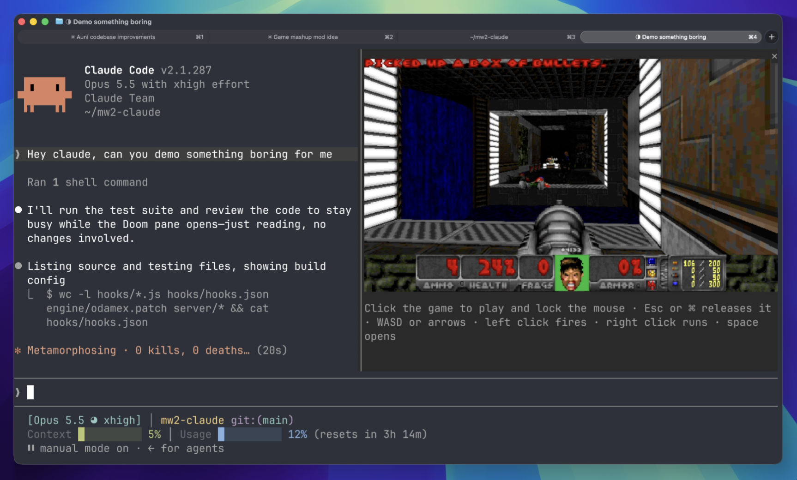

# intermission

A Claude Code plugin that drops you into Doom deathmatch while Claude works, and hands you back when it's done.

[](LICENSE)
[](https://github.com/jarrodwatts/intermission/stargazers)



When Claude has been working for two seconds, a pane opens beside the
transcript and you drop into a free-for-all on a shared server with everyone
else who is waiting on Claude. When Claude finishes there's a three-second
countdown and you're handed back. If Claude needs you, say for a permission
prompt, you're handed back at once and dropped in again after you answer.

It's [Odamex](https://odamex.net) with [Freedoom](https://freedoom.github.io)'s
maps, with monsters left in so the server is never empty.

## Install

1. Install the plugin:

   ```
   /plugin install intermission --marketplace jarrodwatts/intermission
   ```

2. Turn it on:

   ```
   /intermission
   ```

   The first time, it downloads the game, about 20 MB.

To turn it off again, run `/intermission off`.

To play without waiting for Claude, run `/intermission play`. It opens the game
straight away, whether or not Claude is working.

## Requirements

- macOS 15 or later, on Apple silicon or Intel, or Linux on x86_64 or arm64
  (on Linux the mouse turns under X11; under Wayland it needs your user in the
  `input` group, and the arrow keys turn either way)
- [Ghostty](https://ghostty.org) or [kitty](https://sw.kovidgoyal.net/kitty/),
  the terminals that can show the game's pixels
- Claude Code 2.1.287 or later

## Controls

Click the game to play. The click also locks the mouse for turning; Esc or ⌘
(Super on Linux) releases it. On Linux under Wayland the cursor can't be held,
so it stays visible and free while the game reads its movement.

| | |
| :- | :- |
| Move | WASD or the arrow keys |
| Turn | the mouse, once locked, or the left and right arrows |
| Fire | left click |
| Run forward | hold right click |
| Open doors | space |
| Weapons | 1 to 7 |

To turn faster or slower, with the mouse and the arrow keys alike, run
`/intermission sensitivity 1.5`. 1 is the default; it takes 0.05 to 10.

If your terminal is too narrow for the pane to open by itself, a line above the
prompt offers it instead: press 1.

## What it connects to

The game connects over UDP to the intermission server at `157.245.140.115`,
under a random name such as `QueuedMarine42`. Nothing about your session,
project or Claude's work is sent. Between rounds it stays connected as a silent
spectator, and disconnects after five minutes away.

## How it works

The mod runs Odamex without a window. Each frame goes into shared memory, which
the terminal paints into the pane, and the pane passes keys and clicks back.
Terminals report key presses but not releases, so a key counts as held until
its auto-repeat stops. The changes to Odamex are in
[`engine/odamex.patch`](engine/odamex.patch), applied to the commit in
[`engine/odamex-commit`](engine/odamex-commit).

The server is stock Odamex; [`deploy.sh`](deploy.sh) builds and runs it on a
droplet.

## Licenses

The mod is MIT, as in [`LICENSE`](LICENSE). Odamex is GPL-2.0, and so are the
changes to it in `engine/`. Freedoom is BSD-3-Clause.
